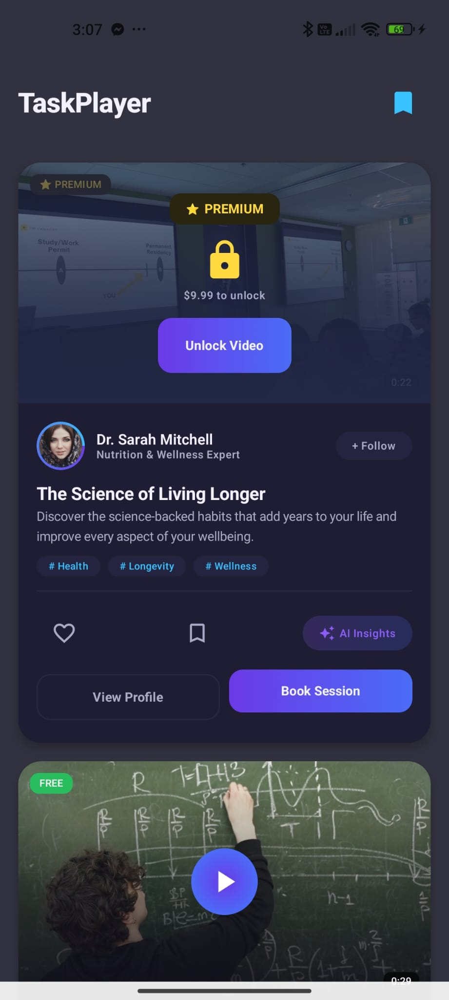
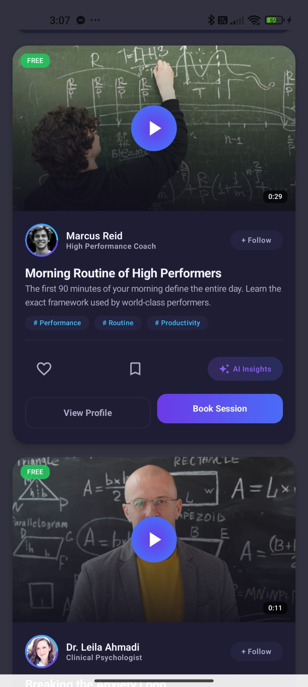
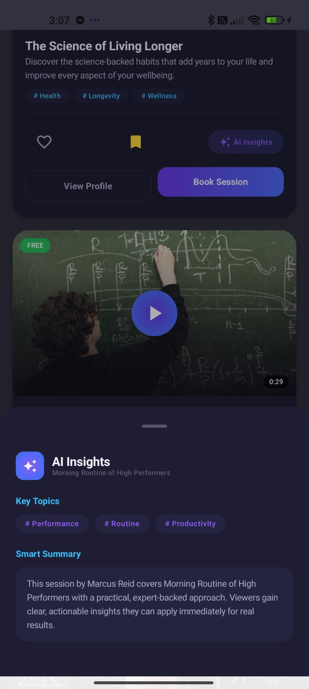
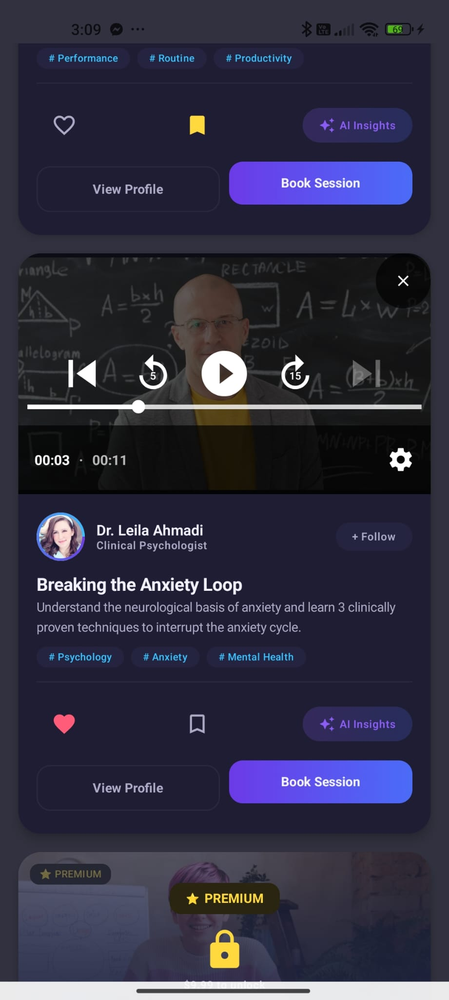
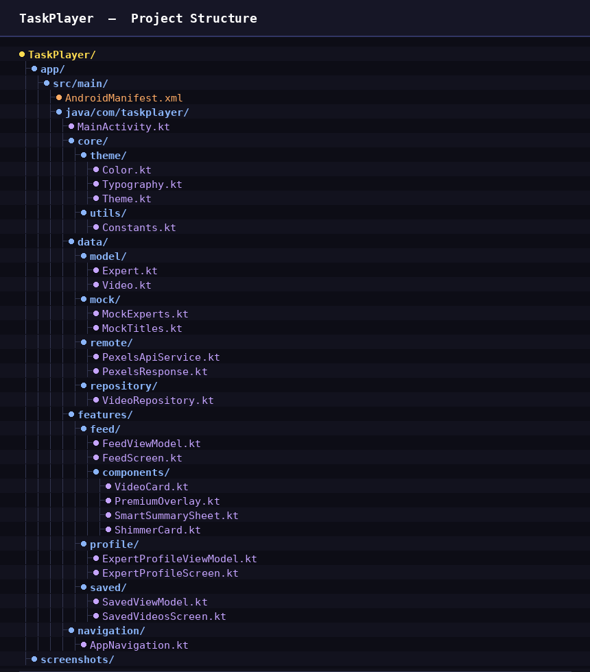

# TaskPlayer

TaskPlayer is an Android app I built as part of a technical evaluation. The idea was to create an expert learning platform where users can watch video sessions from professionals, unlock premium content, follow experts they like, and get a quick AI summary of what a video covers.

I used Kotlin with Jetpack Compose for the UI, ExoPlayer for video playback, and the Pexels API to pull real video content. The whole thing is structured around MVVM so the code stays clean and easy to scale.

---

## Download

[](https://github.com/NadimOvi/TaskPlayer/releases/download/v1.0.0/app-debug.apk)

---

## Screenshots

<p float="left">
  
  
  
  
  
  
</p>

---

## What I Used

| | |
|---|---|
| Language | Kotlin |
| UI | Jetpack Compose |
| Architecture | MVVM + Repository Pattern |
| State | StateFlow + ViewModel |
| Navigation | Compose Navigation |
| Video Player | ExoPlayer (Media3) |
| Networking | Retrofit + OkHttp |
| Image Loading | Coil |
| Video Source | Pexels API |
| Async | Kotlin Coroutines |
| Testing | JUnit4, Coroutines Test, Compose UI Test |

---

## Project Structure



---

## What the App Does

The main screen is a vertical feed of expert video cards. Each card shows the expert's photo, name, title, the video title, a short description, and topic tags. From there you can like a video, save it, follow the expert, open their profile, or book a session.

Videos are either free or premium. Free ones play directly in the app using ExoPlayer. Premium ones show a lock overlay with the price. When you tap Unlock, it runs a short mock flow with an animation and then gives you access to the video.

Each video card has an AI Insights button. Tapping it opens a bottom sheet that shows the key topics as tags and a short summary of what the video covers. This is currently mock logic but it is designed so a real API call can replace it in one place.

The Expert Profile screen shows the expert's photo, bio, stats like followers and rating, and a list of their videos. You can follow them or book a session from there as well.

There is also a Saved Videos screen where all your bookmarked videos appear in a list.

---

## How to Run It

You need Android Studio (Hedgehog or later), Android SDK 26+, and a free Pexels API key which you can get from https://www.pexels.com/api/

Clone the project:
```bash
git clone https://github.com/NadimOvi/TaskPlayer.git
```

Open it in Android Studio, then go to this file and paste your Pexels key:
```
app/src/main/java/com/taskplayer/core/utils/Constants.kt
```
```kotlin
const val PEXELS_API_KEY = "YOUR_KEY_HERE"
```

Then just run it on an emulator or a real device running Android 8.0 or above.

---

## Tests

I wrote unit tests for the repository and viewmodels, and UI tests for the feed screen using Compose testing.

```bash
# run unit tests
./gradlew test

# run UI tests (needs a running emulator or device)
./gradlew connectedAndroidTest
```

| File | What it tests |
|---|---|
| VideoRepositoryTest | like, save, unlock, follow, get expert by id |
| FeedViewModelTest | state updates, smart sheet open/close, access types |
| SavedViewModelTest | saved list behavior, add and remove |
| FeedScreenTest | UI elements are visible, button clicks trigger correct callbacks |

---

## A Few Notes

I did not integrate real payment — the unlock flow is simulated with a short delay and animation. Expert data is hardcoded locally since the task did not require a backend for that. The AI summary is also mock for now but structured cleanly so it is easy to swap in a real model later. The app supports both portrait and landscape mode and state is not persisted between sessions.

---

## About Me

I am Nadim Mahmud. I work with Kotlin, Jetpack Compose, Flutter, AI/ML, and FastAPI. This project was built as a 24-hour technical evaluation task.

GitHub: https://github.com/NadimOvi
